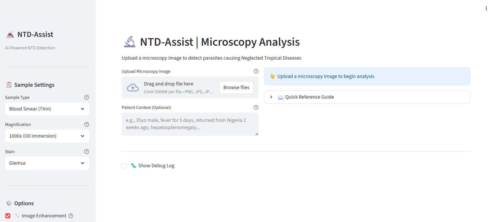

# 🦟 NTD-Assist

AI-powered microscopy diagnosis for Neglected Tropical Diseases using Google's MedGemma.



## 🎯 Features

- Detects 7 major NTDs: Malaria, Leishmaniasis, Trypanosomiasis, Filariasis, Schistosomiasis, Onchocerciasis, Loiasis
- Runs locally with 4-bit quantization (6GB VRAM minimum)
- Domain-specific image enhancement for Giemsa-stained samples
- Morphology guardrails to prevent impossible diagnoses
- PDF report generation

## 🚀 Quick Start

### Requirements
- Python 3.10+
- CUDA-compatible GPU (6GB+ VRAM)
- HuggingFace account with MedGemma access

### Installation

```bash
git clone https://github.com/MohamedFakhry2007/ntd-assist.git
cd ntd-assist
pip install -r requirements.txt
```

Set HuggingFace Token:
```bash
export HF_TOKEN="your_huggingface_token"
```

Run:
```bash
streamlit run app.py
```

## 📊 Demo

- **Kaggle Notebook**: [NTD-Assist Notebook](https://www.kaggle.com/code/mohamedfakhrysmile/ntd-assist-notebook)
- **Video Demo**: [YouTube Demo](https://youtu.be/EDyQBqOuHqk)

## 🏗️ Architecture

```
Image → Enhancement → MedGemma 4B → Guardrails → Structured Diagnosis → PDF
```

## 🏆 MedGemma Impact Challenge

This project was built for the [MedGemma Impact Challenge on Kaggle](https://www.kaggle.com/competitions/med-gemma-impact-challenge/).

## ⚠️ Disclaimer
For educational and screening purposes only. All findings must be confirmed by qualified medical professionals.

## 📄 License

MIT License