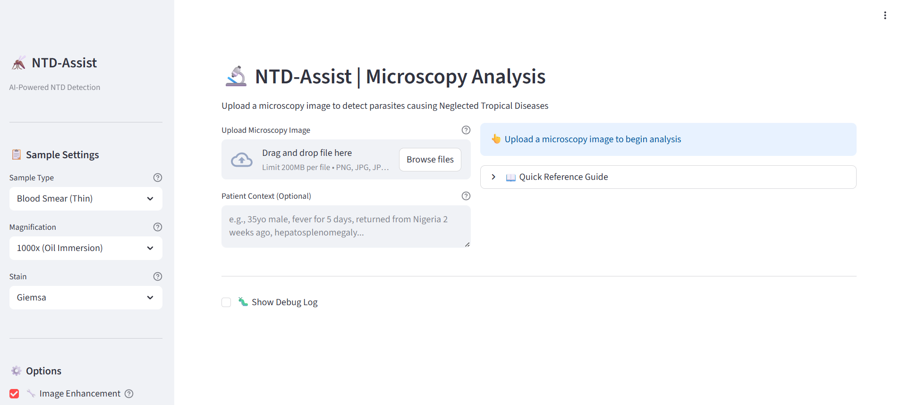
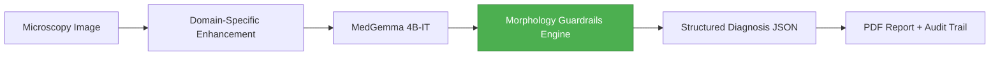

# 🦟 NTD-Assist
## Edge-Deployed Clinical Multimodal AI with Biological Validation Guardrails

> Offline microscopy assistant for Neglected Tropical Diseases — powered by MedGemma 4B, hardened with rule-based morphology validation to prevent biologically impossible diagnoses.


---

## 🔑 Why This Matters

| Challenge | NTD-Assist Solution |
|-----------|---------------------|
| 🩺 Expert scarcity in endemic regions | Runs offline on consumer hardware (6GB VRAM) — no cloud dependency |
| ⚠️ Hallucination risk in medical AI | Morphology guardrails enforce biological plausibility *before* diagnosis |
| 🌐 Low-connectivity settings | Fully local inference; zero API calls; privacy-preserving by design |
| 🎓 Training gaps for new microscopists | Structured output with morphological evidence + PDF audit trail |

**Built by**: Mohamed Fakhry, MD — Clinical AI Engineer specializing in safe, clinically-grounded multimodal systems.

---

## 🎯 Core Innovation: Morphology Guardrails

Raw LLM outputs are unsafe for clinical use. NTD-Assist adds a **rule-based validation layer** that catches biologically impossible diagnoses *before* they reach the user:

```python
# Example guardrail logic
if detected_organism == "Plasmodium" and sample_type != "blood_smear":
    raise BiologicalImpossibilityError("Malaria requires blood smear sample")
    
if location == "inside_RBC" and organism_size > 7μm:
    flag_for_review("RBC-sized structures cannot be amastigotes (2-4μm)")
```

**Validation rules cover**:
- ✅ Sample-type compatibility (e.g., malaria ≠ tissue biopsy)
- ✅ Subcellular location constraints (RBC vs. macrophage vs. extracellular)
- ✅ Morphometric plausibility (size, shape, staining patterns)
- ✅ Species-level biological consistency

> This is not just "AI diagnosis." This is **medically constrained multimodal reasoning** — a pattern applicable far beyond NTDs.

---

## 🦠 Supported Diseases (7 NTDs)

| Disease | Sample Type | Key Morphology |
|---------|------------|----------------|
| Malaria | Blood smear | Ring forms in RBCs |
| Leishmaniasis | Tissue/Bone marrow | Amastigotes in macrophages |
| Trypanosomiasis | Blood/CSF | Extracellular trypomastigotes |
| Filariasis | Blood | Sheathed microfilariae |
| Schistosomiasis | Urine/Stool | Eggs with terminal/lateral spines |
| Onchocerciasis | Skin snip | Unsheathed microfilariae |
| Loiasis | Blood | Sheathed microfilariae with nuclei column |

---

## 🏗️ Architecture


```mermaid
graph LR
    A[Microscopy Image] --> B[Domain-Specific Enhancement]
    B --> C[MedGemma 4B-IT]
    C --> D[Morphology Guardrails Engine]
    D --> E[Structured Diagnosis JSON]
    E --> F[PDF Report + Audit Trail]
    
    style D fill:#4CAF50,stroke:#2E7D32,color:white
```

**Key components**:
1. **Image Enhancement**: Green-channel extraction + adaptive sharpening for Giemsa-stained samples
2. **MedGemma 4B-IT**: Multimodal medical LLM, quantized to 4-bit for edge deployment
3. **Guardrails Engine**: Rule-based validator enforcing biological plausibility
4. **Structured Output**: JSON schema with morphology proof, confidence, recommendations
5. **PDF Generator**: Clinician-friendly report with visual evidence + disclaimer

---

## 🚀 Quick Start

### Requirements
- Python 3.10+
- CUDA-compatible GPU (**6GB VRAM minimum**, 8GB+ recommended)
- HuggingFace account with [MedGemma access](https://huggingface.co/google/medgemma-4b-it)

### Installation
```bash
git clone https://github.com/MohamedFakhry2007/ntd-assist.git
cd ntd-assist
pip install -r requirements.txt
```

### Run
```bash
# Set HuggingFace token
export HF_TOKEN="your_token_here"

# Launch Streamlit app
streamlit run app.py
```

> 💡 Tested on: RTX 3060 (12GB), RTX 4090, Google Colab T4

---

### 🚀 Deploy to Hugging Face Spaces

[](https://huggingface.co/spaces/mofary/ntd-assist)

**Try it now:** [https://huggingface.co/spaces/mofary/ntd-assist](https://huggingface.co/spaces/mofary/ntd-assist)

One-click deploy your own copy to HF Spaces (free tier works — no GPU required):

1. Fork the repo and create a Space at [huggingface.co/spaces](https://huggingface.co/spaces), select **Streamlit** SDK, and connect your GitHub fork.
2. The app auto-detects the environment:
   - **GPU available** → MedGemma 4B (full accuracy)
   - **CPU only / HF Space free tier** → Qwen2-VL-2B-Instruct (lightweight fallback)
3. **Optional GitHub secret** (only if you want GPU MedGemma in a paid Space):
   - `HF_TOKEN`: Your Hugging Face token with gated-model access
4. Done — the `setup.sh` pre-caches the CPU model during build.

| Tier | Model | Performance |
|------|-------|-------------|
| Free (2 vCPU, 16GB, no GPU) | Qwen2-VL-2B-Instruct | ~45-90s per image |
| Paid (T4 GPU, 16GB) | MedGemma 4B | ~10-30s per image |

---

## 📊 Demo & Resources

| Resource | Link |
|----------|------|
| ▶️ Video Demo | [YouTube: 3-min walkthrough](https://youtu.be/EDyQBqOuHqk) |
| 💻 Executable Notebook | [Kaggle: NTD-Assist Notebook](https://www.kaggle.com/code/mohamedfakhrysmile/ntd-assist-notebook) |
| 🤗 Model Card | *(coming soon)* |
| 📝 Technical Deep-Dive | *(coming soon)* |

---

## 🎯 Who Should Use This

✅ **Laboratory technicians** in district hospitals needing a second opinion  
✅ **Global health researchers** prototyping offline AI tools  
✅ **AI engineers** studying safe multimodal reasoning patterns  
✅ **Educators** teaching parasitology morphology  

## 🚫 Who Should NOT Use This

❌ As a standalone diagnostic tool without professional confirmation  
❌ In regulatory-approved clinical workflows without further validation  
❌ For species-level identification requiring PCR confirmation  

---

## ⚠️ Safety & Limitations

> **NTD-Assist is for educational and screening purposes only.**  
> All findings must be confirmed by qualified medical professionals. This tool should not be used as the sole basis for clinical decisions.

**Known limitations**:
- Model not fine-tuned on large NTD-specific datasets (future work)
- Image quality heavily dependent on proper staining, focus, and lighting
- Guardrails reduce but do not eliminate false positives/negatives
- Species-level accuracy may require orthogonal confirmation (e.g., rK39, PCR)

---

## 📈 Impact Potential

- 🌍 1.7 billion people affected by NTDs annually
- 🔬 200+ million malaria tests performed in Africa each year
- 🎯 If NTD-Assist assists just 10% of high-volume microscopists: **20M+ AI-validated screenings/year**
- 📉 Potential to reduce misdiagnosis-related treatment delays in resource-limited settings

---

## 🗓️ Roadmap (v2)

- [ ] Explainability heatmaps (Grad-CAM overlay on detected structures)
- [ ] Confidence scoring with uncertainty quantification
- [ ] Multilingual UI (Arabic, French, Portuguese)
- [ ] Benchmark suite against public NTD datasets
- [ ] ONNX export for mobile deployment research

*Contributions welcome — especially from clinicians, parasitologists, and global health engineers.*

---

## 📄 License & Citation

**Code**: MIT License  
**Documentation & Writeups**: CC BY 4.0  

```bibtex
@misc{fakhry2026ntdassist,
  title = {NTD-Assist: Edge-Deployed Clinical Multimodal AI with Biological Validation Guardrails},
  author = {Fakhry, Mohamed},
  year = {2026},
  howpublished = {\url{https://github.com/MohamedFakhry2007/ntd-assist}},
  note = {Built for the MedGemma Impact Challenge, Kaggle}
}
```

---

## 👤 Author

**Mohamed Fakhry, MD**  
Clinical AI Engineer | Multimodal Systems | Clinical Safety & Guardrails  
🔗 [LinkedIn](https://www.linkedin.com/in/mohamed-fakhry4) | 🐙 [GitHub](https://github.com/MohamedFakhry2007)

*Building clinically-grounded AI that works where it's needed most.*